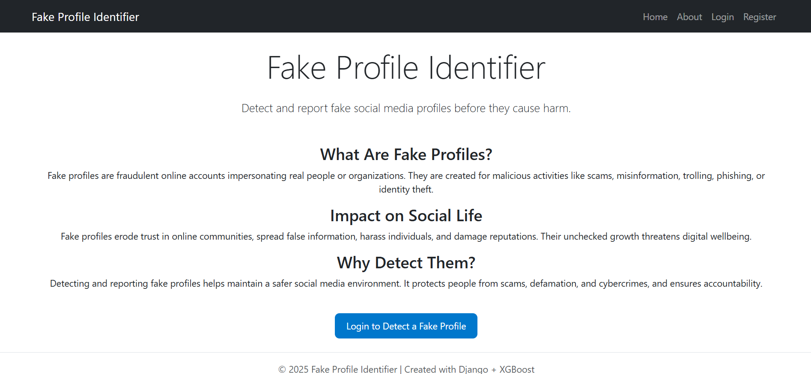
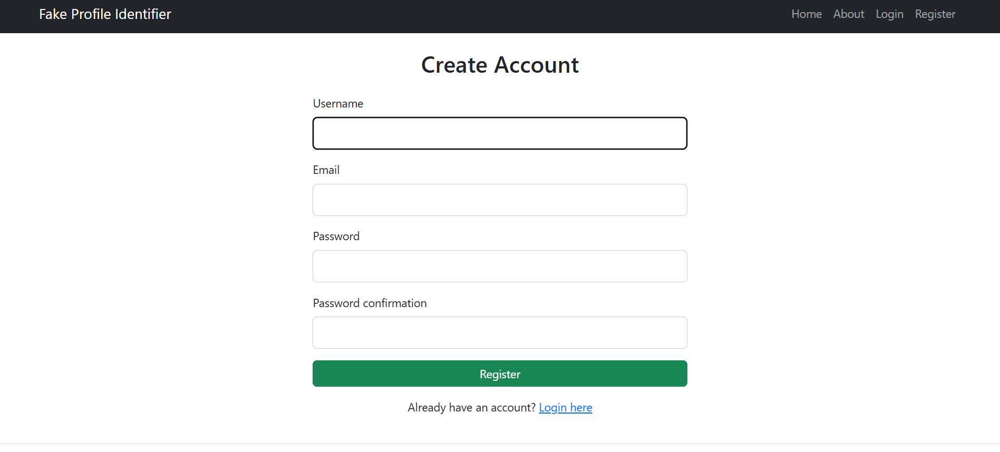
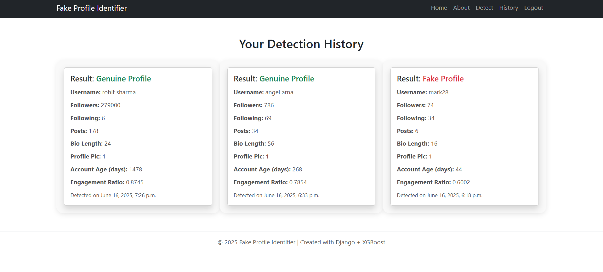
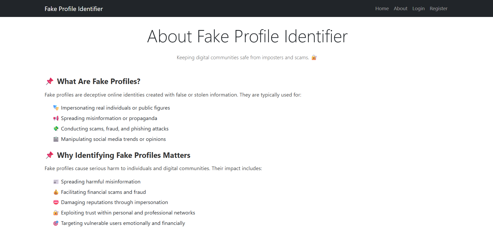

# 🛡️ Fake Profile Identifier

A machine learning-powered web application built with **Django**, designed to detect fake profiles on social media in real time using an XGBoost model.

> 🔴 LIVE at: [https://fake-profile-identifier.onrender.com](https://fake-profile-identifier.onrender.com)

---

## 📸 Screenshots

| Home | Detect | History | About |
|------|--------|---------|-------|
|  |  |  |  |


---

## 📌 Overview

The **Fake Profile Identifier** tackles the growing issue of online identity fraud by providing a secure, intuitive platform for detecting fake social media profiles.

🧠 The detection engine is powered by a trained **XGBoost** model, and the application is hosted using **Render** for real-time availability.

---

## 🧠 ML Model Summary

- ✅ **Model**: XGBoost Classifier (`model.pkl`)
- 🧹 Preprocessing: Missing value handling, label encoding, feature scaling
- 📊 Evaluation: Accuracy, Precision, Recall, F1-score
- 🛠️ Trained using: `scikit-learn==1.6.1`

---

## 🧱 Tech Stack

| Layer        | Technology           |
|--------------|----------------------|
| Frontend     | HTML, Bootstrap, CSS |
| Backend      | Django 4.x           |
| ML Model     | XGBoost, scikit-learn, NumPy |
| Database     | SQLite 3             |
| Deployment   | Render.com           |
| Web Server   | Gunicorn             |

---

## 📁 Project Structure

```
fake_profile_identifier/
│
├── ML/ # ML model and data
│ ├── model.pkl
│ └── realistic_fake_profile_data.csv
│
├── detection_app/ # Core Django app
│ ├── templates/ # HTML templates
│ ├── views.py
│ ├── models.py
│ └── forms.py
│
├── fake_profile_identifier/ # Django project config
│ ├── settings.py
│ └── wsgi.py
│
├── static/ # CSS and assets
├── staticfiles/ # Collected static files (for deployment)
├── db.sqlite3 # SQLite database
├── requirements.txt
├── manage.py
└── .render.yaml # Optional Render config
```

---

## ⚙️ Setup Instructions (Local)

```bash
# 1. Clone this repo
git clone https://github.com/mahanth-kanaparthi/fake-profile-identifier.git
cd fake-profile-identifier

# 2. Create a virtual environment
python -m venv .env
source .env/bin/activate   # Windows: .env\Scripts\activate

# 3. Install dependencies
pip install -r requirements.txt

# 4. Apply migrations
python manage.py migrate

# 5. Run the development server
python manage.py runserver

# 6.Visit: 
link: http://127.0.0.1:8000/
```

## ✅ Features
🔐 User registration and login

📤 Real-time fake profile prediction

🧠 ML model integration with XGBoost

📊 History tracking per user

🎨 Responsive Bootstrap frontend

📝 Reporting interface for flagged profiles

⚙️ Secure deployment on Render

## 📌 TODOs & Future Enhancements
🧾 Admin moderation for flagged reports

🧠 Retraining pipeline via UI

📥 Batch detection using CSV upload

🧪 Add unit tests and CI pipeline

🌐 URL-based profile scraping and analysis

## 🙌 Contributing
PRs and issues are welcome!
Please follow standard commit guidelines and raise an issue before submitting large changes.

## 📄 License
This project is licensed under the MIT License. See LICENSE  for details.

## 🙋‍♂️ Contact
Built with ❤️ by Mahanth Kanaparthi
DM me or raise an issue for any questions or suggestions!
